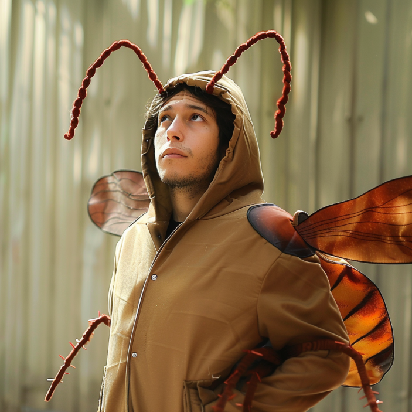
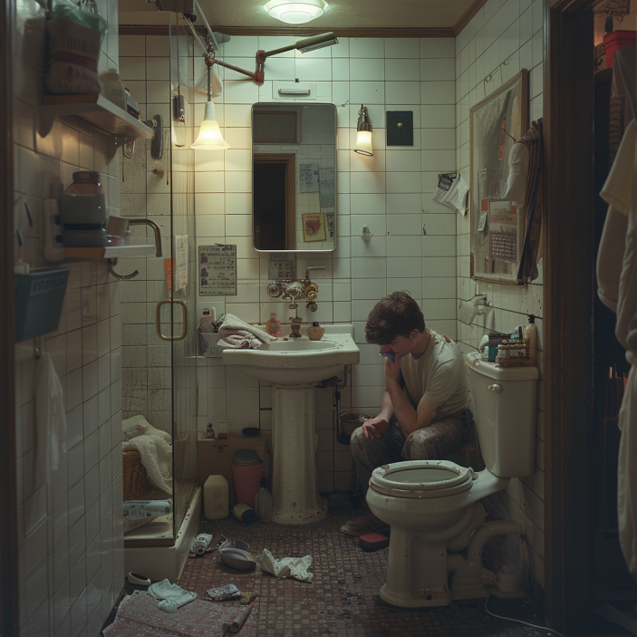

# Pest Quest

by [Manuel](mailto:manuel.velarde@proton.me) and [Esteban](mailto:estebanvelardegarcez@gmail.com) Velarde

**Pest Quest** is a game that aims to parody video games that have impacted our lives, while exploring aspects of our personal history and experiences with depression.

### Summary

[Hermann](./Characters/Hermann.md
) has faced a tough few months trying to deal with his father's suicide. As things in his life begin to feel increasingly unmanageable, his partner decides to leave. Now on his own, Hermann is at a crossroads: fight to get back on track or give in to the overwhelming wave of depression.

As a cockroach dwelling in the growing piles of trash in Hermann's home, we accompany Hermann on his journey. Each mission allows us to discover various aspects of Hermann's life. Additionally, our choices at key moments will shape the direction and outcome of Hermann's battle.

**Figure 1.** The player, as a miniature Hermann, in a cockroach costume.

It all begins when Hermann's partner, [Lily](./Characters/Lily.md), is packing her bags. While Hermann sits unresponsive in a corner of the washroom, a cockroach scuttles across the floor unnoticed. From the bedroom, Lily tries to articulate her reasons for leaving.

Lily enters the washroom and offers an apology to Hermann. She quickly discards some items into the garbage bin while carefully picking others to take with her to the room. As she exits, she inadvertently leaves the bathroom door ajar. Amongst the discarded items was the cockroach's home.

With a final, sorrowful farewell, Lily departs. The cockroach embarks on a quest through the bedroom determined to find a new sanctuary to call home. Hermann remains unresponsive sitting in corner of the bathroom.

**Figure 2.** Hermann sits unresponsive in a corner of his washroom.